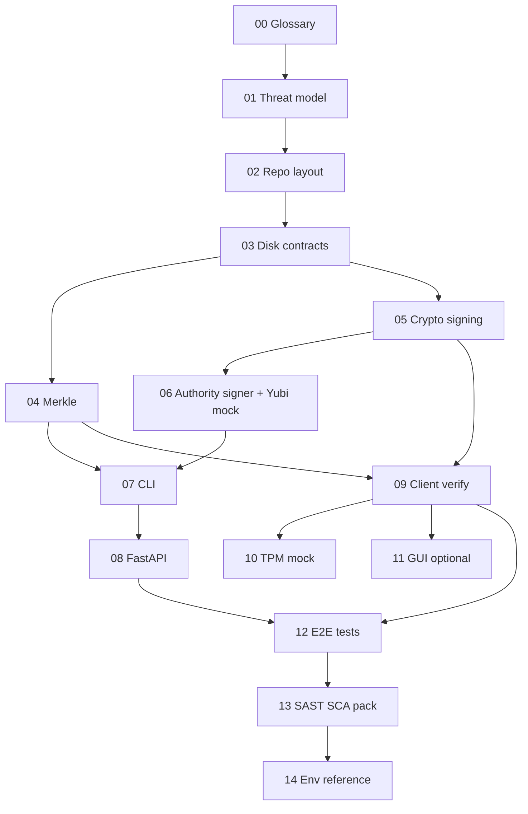

# QRBT — specyfikacja implementacyjna (taski od zera)

Ten katalog to **instrukcja odtworzenia** systemu typu QRBT (Quantum-Resistant Binary Transparency) w nowym, „produkcyjnym” repozytorium. Obecny projekt w katalogu nadrzędnym jest **wersją badawczą**; te dokumenty mają być **jedynym źródłem prawdy** dla czystej implementacji.

## Jak z tego korzystać

1. Czytaj pliki **w kolejności numerów** (00 → 14).
2. Każdy plik = jeden większy task (lub grupa ściśle powiązanych). W środku: cele, kontrakty danych, kroki, kryteria ukończenia, pułapki.
3. Implementacja w nowym repo: jeden PR na task albo logiczny podział pod zespół.

## Mapa dokumentów

| Plik | Task |
|------|------|
| [00-prerequisites-and-glossary.md](00-prerequisites-and-glossary.md) | Słownik, zależności, wersje Pythona |
| [01-threat-model-trust-boundaries.md](01-threat-model-trust-boundaries.md) | Model zaufania, granice, co system gwarantuje |
| [02-repository-layout.md](02-repository-layout.md) | Struktura pakietów, moduły, entrypointy |
| [03-data-on-disk-contracts.md](03-data-on-disk-contracts.md) | `keys.json`, manifest, log, pliki PEM/hex |
| [04-merkle-tree-spec.md](04-merkle-tree-spec.md) | Drzewo Merkle, proof, serializacja API |
| [05-cryptography-manifest-signing.md](05-cryptography-manifest-signing.md) | Ed25519, ML-DSA-65, kanoniczny JSON manifestu |
| [06-authority-signer-abstraction-yubikey-mock.md](06-authority-signer-abstraction-yubikey-mock.md) | **Abstrakcja podpisu authority + mock YubiKey/HSM** |
| [07-server-cli-commands.md](07-server-cli-commands.md) | `init`, `rotate-ephemeral`, `add-release`, `serve` |
| [08-fastapi-http-api.md](08-fastapi-http-api.md) | Endpointy, kody błędów, brak wycieku root pub |
| [09-client-verification-protocol.md](09-client-verification-protocol.md) | Kolejność weryfikacji CLI/daemon |
| [10-tpm-mock-and-version-policy.md](10-tpm-mock-and-version-policy.md) | Anti-rollback, semver vs string |
| [11-gui-client-spec.md](11-gui-client-spec.md) | Opcjonalny GUI — zakres i API |
| [12-integration-tests-e2e.md](12-integration-tests-e2e.md) | Testy E2E, scenariusze ataków |
| [13-sast-sca-evidence-pack.md](13-sast-sca-evidence-pack.md) | Dowody pod kryteria PDF (SAST/SCA) |
| [14-environment-variables.md](14-environment-variables.md) | Env vars: `QRBT_DATA_DIR`, backend authority, mock PIN |

## Zależności między taskami (graf)

## Relacja do wersji badawczej

W repo badawczym logika jest skondensowana głównie w `server.py` + `merkle.py` + klientach. W nowym projekcie **rozłóż** to zgodnie z `02-repository-layout.md` i **wymuś** `AuthoritySigner` z `06-…` — to główna różnica jakościowa względem prototypu.

## Mapowanie plików badawczych → taski

| Badawcze | Dokument docelowy |
|----------|---------------------|
| `server.py` (init, rotate, add_release, API) | 03, 05, 06, 07, 08 |
| `merkle.py` | 04 |
| `client_cli.py`, `client_gui.py` | 09, 10, 11 |
| `export_authority_pub.py` | 06, 07 |
| `requirements.txt` / zależności | 00, 13 |
| `test.sh` | 12 |
